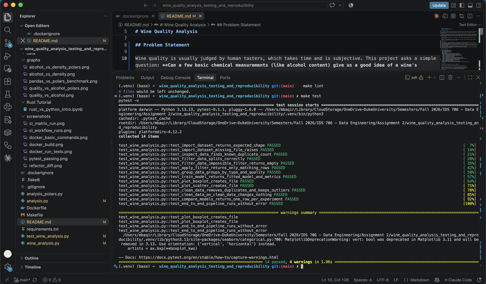
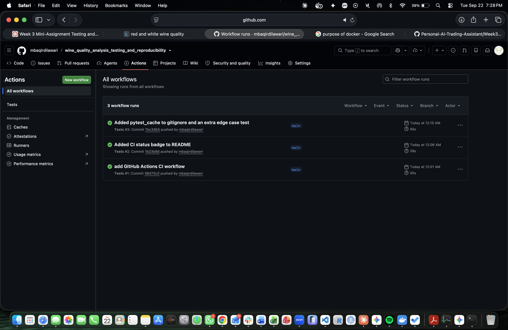
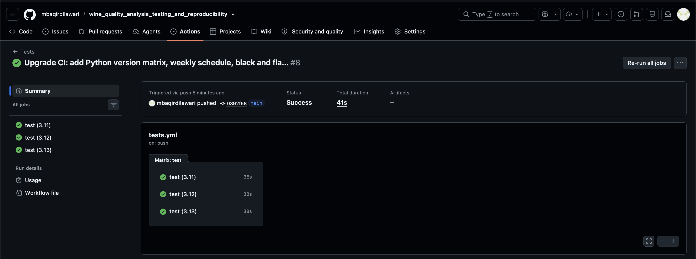
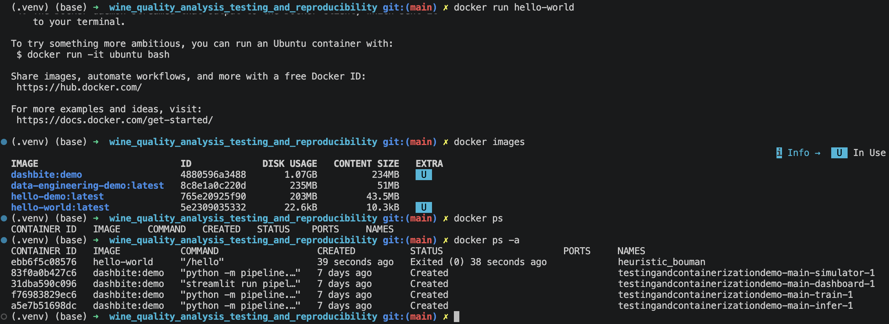
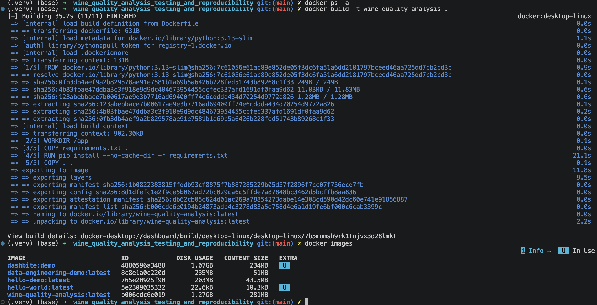
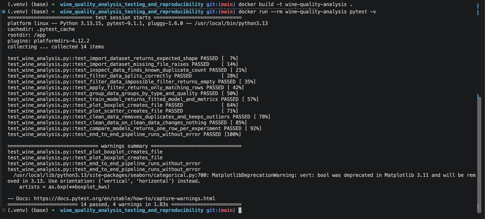
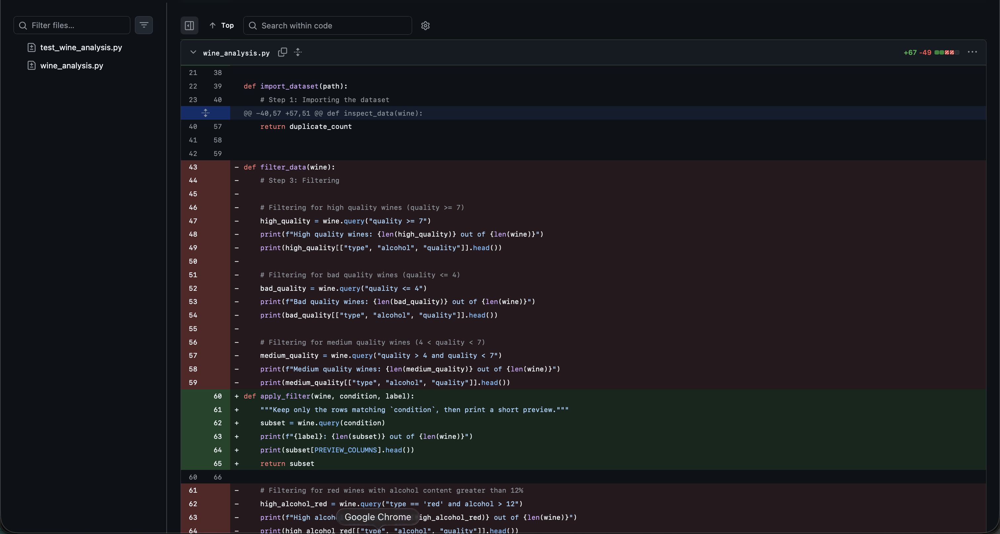
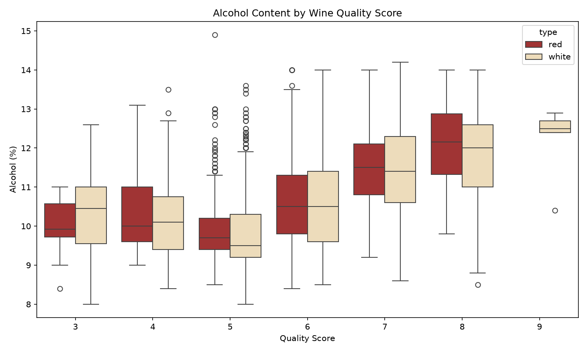
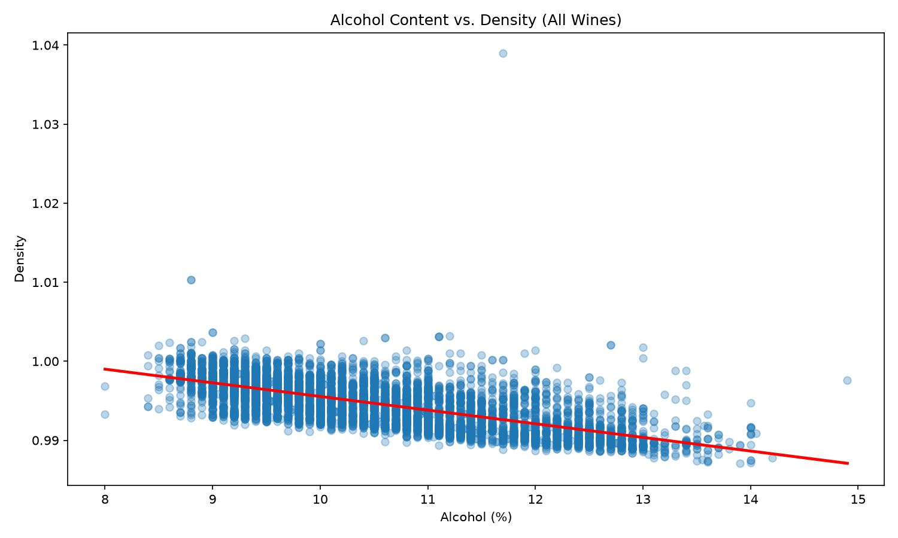

# IDS706 - Week 4 Major Assignment


# Wine Quality Analysis
### With Testing & Reproducibility

## Problem Statement

Wine quality is usually judged by human tasters, which takes time and is subjective. This project asks a question: 
**Can a few basic chemical measurements (such as alcohol content) give us a good idea of a wine's quality score?**

To answer it, the project loads and inspects a real dataset of red and white wines, explores it with filtering, grouping and charts, cleans it, and trains a simple linear regression model to predict quality. Along the way, the code is made **reproducible and reliable** with automated tests, a CI workflow, code-quality tools and a Docker container.

You can run it through pandas via the `"analysis.py"` file. Pandas is the widely-supported default with the biggest ecosystem.

Or you can run it through polars via the `"analysis_polars.py"` file. Polars are used when speed and memory efficiency is the priority for larger sets of data.

## Key Findings

- **Alcohol helps, volatile acidity hurts:** higher-quality wines tend to have more alcohol, while volatile acidity (linked to a vinegar-like taste) is the strongest sign of lower quality.
- **The data needed cleaning:** there were no missing values, but 1,177 rows (about 18%) were exact duplicates. These were removed before the final model comparison. Outliers were kept, because the most extreme ones turned out to be real wines.
- **Cleaning and more features each helped a little:** R² rose from 0.253 (original model) to 0.275 (duplicates removed) and then to 0.302 (all 11 measurements). See [Step 9](#step-9-comparing-models).
- **But chemistry alone only explains about 30% of quality:** taste is subjective, so a wine's score depends on more than these lab measurements.

## Table of Contents

- [Key Findings](#key-findings)
- [The Dataset](#the-dataset)
- [How to Run](#how-to-run-this)
- [Testing & CI](#testing--ci)
- [Docker](#docker)
- [Refactoring & Code Quality](#refactoring--code-quality)
- [Step by Step walkthrough](#step-by-step-walkthrough)
  - [Step 1: Importing the dataset](#step-1-importing-the-dataset)
  - [Step 2: Inspecting the Data](#step-2-inspecting-the-data)
  - [Step 3: Filtering](#step-3-filtering)
  - [Step 4: Grouping](#step-4-grouping)
  - [Step 5: Machine Learning model](#step-5-machine-learning-model)
  - [Step 6: Visualization - Boxplot](#step-6-visualization---boxplot)
  - [Step 7: Visualization - Scatter Plot](#step-7-visualization---scatter-plot)
  - [Step 8: Cleaning the Data](#step-8-cleaning-the-data)
  - [Step 9: Comparing Models](#step-9-comparing-models)
- [Overall Findings](#overall-findings)
- [Pandas vs Polars Benchmark](#pandas-vs-polars-benchmark)
- [Model Limitations and Future Directions](#model-limitations-and-future-directions)

## The Dataset

**Wine Quality (Red and White)**, sourced from Kaggle:

https://www.kaggle.com/datasets/amirmohamadrezaie/red-and-white-wine-quality

The file `data/wine_quality_merged.csv` contains both red and white wine samples
combined into a single file, with a `type` column that already labels each row as
`"red"` or `"white"`. Each row is one wine sample, described by 11 chemical
measurements, plus a `quality` score from 0–10 assigned by wine tasters. 
The columns are:

`fixed acidity, volatile acidity, citric acid, residual sugar, chlorides, free sulfur
dioxide, total sulfur dioxide, density, pH, sulphates, alcohol, quality, type`

## How to run this

These steps assume you have already cloned this repository and have a terminal open inside the `wine_quality_analysis_testing_and_reproducibility` folder.

### 1. Create a virtual environment

Run this in the **terminal**:

```bash
python3 -m venv .venv
```

This creates a folder called `.venv` that holds a clean, isolated copy of Python just for this project, so the packages you install do not clash with anything else on your machine.

### 2. Activate the virtual environment

Run this in the **terminal**:

```bash
source .venv/bin/activate
```

You will know it worked because your terminal prompt will now show `(.venv)` at the start of the line. You need to run this activation command every time you open a new terminal window to work on this project.

### 3. Install the required packages

Run this in the **terminal** (with the virtual environment still active):

```bash
pip install -r requirements.txt
```

This reads the `requirements.txt` file in this repo and installs the libraries both scripts need: `pandas`, `polars`, `pyarrow`, `matplotlib`, `seaborn`, and `scikit-learn`, plus the tools used for testing and code quality: `pytest`, `black`, and `flake8`.

### 4. Add the dataset

This is a **file/folder step, not a terminal command**: 
Make sure `wine_quality_merged.csv` is placed inside a folder named `data/`, sitting right next to `analysis.py`. The folder structure should look like this:

```
wine_quality_analysis_testing_and_reproducibility/
├── analysis.py              # runs every step in order
├── analysis_polars.py       # same analysis using Polars + benchmark
├── wine_analysis.py         # the functions for each step
├── test_wine_analysis.py    # the test suite
├── data/
│   └── wine_quality_merged.csv
├── graphs/
├── screenshots/
├── Dockerfile
├── requirements.txt
├── Makefile
└── README.md
```

If you do not have the dataset yet, download it from the Kaggle link in the "Dataset" section above and place it in the `data/` folder.

### 5. Run the script

Run this in the **terminal**:

```bash
python analysis.py
```

This runs every step of `analysis.py` from top to bottom: it loads the dataset, prints inspection details, prints the filtering and grouping results, trains the model and prints its performance, saves two charts, then cleans the data and prints the model comparison table.

There is also `analysis_polars.py`, which does the exact same analysis and produces the same
results using [Polars](https://pola.rs/) instead of Pandas, plus a Pandas-vs-Polars speed
benchmark as a final step (see the [Pandas vs Polars Benchmark](#pandas-vs-polars-benchmark)
section below). Run it the same way:

```bash
python analysis_polars.py
```

### 6. Check the output

You do not need to run anything for this step. Just look at what happened:

- All the printed results (row counts, `.describe()` output, filter counts, group tables, model error and R-squared) appear directly in your **terminal**.
- `analysis.py` creates two image **files** inside the `graphs/` folder: `graphs/quality_vs_alcohol.png` and `graphs/alcohol_vs_density.png`. `analysis_polars.py` creates the Polars equivalents (`graphs/quality_vs_alcohol_polars.png`, `graphs/alcohol_vs_density_polars.png`) plus `graphs/pandas_vs_polars_benchmark.png`. Open these from VS Code's file explorer (or any image viewer) to see the charts.

### Optional: using the Makefile shortcuts

If you would rather not type each command separately, this repo includes a `Makefile` with shortcuts. These also run in the **terminal**:

- `make setup` - creates the virtual environment and installs the requirements (does steps 1–3 for you)
- `make run` - runs `analysis.py` (does step 5 for you)
- `make run-polars` - runs `analysis_polars.py`, the Polars version plus the benchmark
- `make clean` - deletes the generated charts and cached Python files, useful if you want a fresh run
- `make test` - runs the test suite
- `make lint` - checks code style (`flake8`) and formatting (`black --check`)
- `make format` - automatically formats the code with `black`

## Testing & CI

This project includes a suite of unit and system tests in `test_wine_analysis.py`, covering data loading, preprocessing/filtering, grouping, model training and evaluation, and chart generation, plus one end-to-end test that runs the full pipeline.

Run the tests with:

```bash
pytest -v
```

A GitHub Actions workflow (`.github/workflows/tests.yml`) checks the project automatically:

- **When it runs:** on every push and pull request, every Monday at 9am ET (scheduled run), and on demand via the "Run workflow" button
- **Matrix strategy:** the full suite runs in parallel on Python 3.11, 3.12 and 3.13
- **Quality checks:** `black --check` (formatting) and `flake8` (linting) must pass before the tests run
- **Status:** see the badge at the top of this README

**All tests passing locally:**



**GitHub Actions workflow runs:**



**Matrix run: tests passing on Python 3.11, 3.12 and 3.13:**



## Tests Summary

`test_import_dataset_returns_expected_shape` checks that the CSV loads correctly and has the expected 6,497 rows and 13 columns.<br>
`test_import_dataset_missing_file_raises` checks that trying to load a file that does not exist raises a clear error instead of failing silently.<br>
`test_inspect_data_finds_known_duplicate_count` checks that the known 1,177 duplicate rows in the dataset are detected correctly.<br>
`test_filter_data_splits_correctly` checks that all five filters (high quality, low quality, medium quality, high-alcohol red, low-alcohol red) only keep rows that actually match their condition, and that every wine falls into exactly one quality bucket.<br>
`test_filter_data_impossible_filter_returns_empty` checks that filtering for an extreme condition still behaves correctly instead of crashing or returning something unexpected.<br>
`test_apply_filter_returns_only_matching_rows` checks that the `apply_filter` helper keeps only matching rows, and returns an empty result (instead of crashing) for an impossible condition.<br>
`test_group_data_groups_by_type_and_quality` checks that grouping the data by wine type and by quality score both produce valid, non-empty summary tables.<br>
`test_train_model_returns_fitted_model_and_metrics` checks that the linear regression model trains successfully and produces sane error and R-squared values.<br>
`test_plot_boxplot_creates_file` checks that the boxplot function actually saves a real, non-empty image file.<br>
`test_plot_scatter_creates_file` checks that the scatter plot function actually saves a real, non-empty image file.<br>
`test_clean_data_removes_duplicates_and_keeps_outliers` checks that cleaning removes exactly the 1,177 duplicates, leaves no missing values, and keeps the outliers we decided to keep.<br>
`test_clean_data_on_clean_data_changes_nothing` checks (edge case) that cleaning data that is already clean does not remove anything else.<br>
`test_compare_models_returns_one_row_per_experiment` checks that the model comparison returns one row per experiment, with the right row counts and sensible scores.<br>
`test_end_to_end_pipeline_runs_without_error` runs the entire pipeline from start to finish, exactly like analysis.py does, to confirm every step still works correctly together as a whole.<br>

Alongside these, the GitHub Actions workflow automatically installs the project's dependencies and runs this full test suite every time code is pushed to the repository, so any change that breaks something gets caught right away instead of being discovered later.

---

## Docker

The project is containerized so it runs the same way on any machine, with no local Python setup needed.

**Build the image:**

```bash
docker build -t wine-quality-analysis .
```

**Run the analysis:**

```bash
docker run --rm wine-quality-analysis
```

**Run the tests inside the container:**

```bash
docker run --rm wine-quality-analysis pytest -v
```

**What I learned:**

- An **image** is a packaged snapshot (code + Python + dependencies); a **container** is a running instance of it.
- Copying `requirements.txt` and installing packages *before* copying the code lets Docker cache that layer, so rebuilds after code changes take seconds.
- A `.dockerignore` keeps the image small by excluding files the analysis does not need (git history, virtual environment, screenshots).
- Adding a command after the image name (e.g. `pytest -v`) overrides the default `CMD`, so one image can both run the analysis and test it.

**Basic Docker commands (pull, run, images, ps):**



**Successful image build:**



**All 10 tests passing inside the container:**



## Refactoring & Code Quality

**What I changed** (in `wine_analysis.py`):

- **Extracted `apply_filter()`**: `filter_data` repeated the same 3 lines (query, print count, print preview) five times; each filter is now a single call to this helper.
- **Named the magic numbers**: thresholds like `7`, `4`, `12` and `10` are now constants (`HIGH_QUALITY_MIN`, `LOW_QUALITY_MAX`, `HIGH_ALCOHOL_MIN`, `LOW_ALCOHOL_MAX`) defined once at the top of the file.
- **Removed duplicated statistics**: both groupings in `group_data` shared the same four alcohol stats, now defined once in `ALCOHOL_STATS`.
- **Extracted `save_plot()`**: both chart functions repeated the same title, labels, layout, save and close steps.
- **Renamed `bad_quality` to `low_quality`** (with VS Code's F2 rename) so the variable matches its threshold, `LOW_QUALITY_MAX`.
- **Fixed an outdated comment**: the module docstring pointed to a `tests/` folder that does not exist.
- **Added a test** for the new `apply_filter()` helper, covering a normal case and an edge case (an impossible condition returns an empty result).
- **Added Makefile shortcuts**: `make format`, `make lint` and `make test`.

**Why:** less copy-pasted code means a change only has to be made in one place, and named thresholds make the filtering rules readable at a glance.

**Use of AI:** I used an AI coding assistant to identify code smells (duplicated blocks, magic numbers, an outdated comment) and reviewed each suggestion before applying it. One idea I rejected was replacing the five filters with a loop over a dictionary of conditions: it would be shorter, but `analysis.py` and the tests rely on five clearly named results, so the loop would have made the code harder to read.

**How I verified it still works:**

- All tests pass (11, including the new one), both locally and in CI
- `black --check .` and `flake8 .` report no issues
- The output of `python analysis.py` is identical before and after the refactor: the structure changed, the behavior did not

**Before/after commit diff:** the repeated filter blocks (red) replaced by the `apply_filter` helper (green):



## Step-by-step walkthrough

### Step 1: Importing the dataset

**What this step does:** 

Loads the single merged CSV file into a pandas DataFrame (a table) and takes a first look at how the two wine types are represented in it.

```python
wine = pd.read_csv("data/wine_quality_merged.csv")
print(f"Total rows: {len(wine)}")
print(wine["type"].value_counts())
```

**What we found:** 

*The dataset has 6,497 wines total.*
*4,898 white (about 75%) and 1,599 red (about 25%), so white wines make up the large majority of the combined file.*

---

### Step 2: Inspecting the Data

**What this step does:** 

Looks at the data's structure and health before doing any
real analysis. Its shape, what the columns look like, what type of data each holds, and
whether anything is missing or duplicated.

```python
print(f"Shape (rows, columns): {wine.shape}")
print(wine.head())
wine.info()
print(wine.describe())
print("Missing values:")
print(wine.isnull().sum())
print(f"Duplicate rows: {wine.duplicated().sum()}")
```

**What we found:** 

*`wine.shape` confirms the dataset is 6,497 rows by 13 columns.*
*No column has any missing values. Every one of the 13 columns shows 0 missing across all 6,497 rows.*
*There are, however, 1,177 exact duplicate rows (about 18% of the dataset), rows that repeat another row's values identically.* 
*.describe() shows that most chemical measurements are fairly tight (e.g. alcohol ranges from 8.0% to 14.9%, averaging 10.49%), but residual sugar is heavily skewed: its 75th percentile is 8.1 but its maximum is 65.8, meaning a small number of unusually sweet wines pull the average up.*

---

### Step 3: Filtering

**What this step does:** 

Pulls out five different meaningful subsets of the data,
using `.query()` to write each condition as plain text. This shows filtering on a
single numeric range, a combined range, and combined conditions across two columns
(type *and* alcohol) at once.

```python
high_quality = wine.query("quality >= 7")
bad_quality = wine.query("quality <= 4")
medium_quality = wine.query("quality > 4 and quality < 7")
high_alcohol_red = wine.query("type == 'red' and alcohol > 12")
low_alcohol_red = wine.query("type == 'red' and alcohol < 10")
```

**What we found:** 

If we consider alcohol quality, out of 6,497 wines: 
- 1,277 (about 20%) are high quality (score ≥ 7)
- 246 (about 4%) are bad quality (score ≤ 4)
- the remaining 4,974 (about 77%) fall in the medium range
*So most wines cluster around average quality, and truly bad wines are rare.* 

Secondly, among red wines specifically:
- 141 (about 9% of all reds) have alcohol above 12%
- 680 (about 43% of all reds) have alcohol below 10%
*Therefore, lower-alcohol reds are considerably more common than higher-alcohol ones.*

---

### Step 4: Grouping

**What this step does:** 

Splits the dataset into groups and computes summary
statistics for each group. First by wine type, and then by quality score.

```python
by_type = wine.groupby("type").agg(
    avg_alcohol=("alcohol", "mean"),
    avg_quality=("quality", "mean"),
    no_of_wines=("quality", "count"),
)

by_quality = wine.groupby("quality").agg(
    avg_alcohol=("alcohol", "mean"),
    no_of_wines=("alcohol", "count"),
)
```

**What we found:** 

*White wines average a slightly higher quality score than red (5.88 vs. 5.64) despite very similar average alcohol content (10.51% vs. 10.42%).*
*White also shows more variation in alcohol (std 1.23 vs. 1.07).* 
*The alcohol-by-quality relationship is not perfectly straight-line: quality scores 3 and 4 actually have slightly higher average alcohol (10.2%) than quality 5 (9.8%, the lowest point in the table), but from quality 5 upward the trend climbs steadily and clearly:* 
*9.8% → 10.6% → 11.4% → 11.7% → 12.2% across quality 5 through 9. Overall, higher-quality wines do tend to have more alcohol, especially in the upper half of the range.*

---

### Step 5: Machine Learning model

**What this step does:** 

Trains a Linear Regression model, the simplest predictive
model there is. To predict a wine's quality score from three of its chemical
properties, then measures how good its predictions were on data it never saw during
training.

```python
features = ["alcohol", "volatile acidity", "sulphates"]
X = wine[features]
y = wine["quality"]

X_train, X_test, y_train, y_test = train_test_split(
    X, y, test_size=0.2, random_state=42
)

model = LinearRegression()
model.fit(X_train, y_train)
predictions = model.predict(X_test)

mse = mean_squared_error(y_test, predictions)
r2 = r2_score(y_test, predictions)
```

Each feature's learned coefficient is then printed with a loop:
```python
for feature, coef in zip(features, model.coef_):
    print(f"{feature}: {coef:.3f}")
```
`model.coef_` holds one number per feature, in the same order as `features`; `zip()`
pairs each feature name with its coefficient so the loop can print both together. A
positive coefficient means "as this feature goes up, predicted quality tends to go up
too"; negative means the opposite.

**What we found:** 

*The model's Mean Squared Error was 0.551 and R-squared was 0.253*

*These three features (alcohol, volatile acidity, sulphates) explain about 25% of the variation in quality, a real but modest amount, since quality clearly depends on more than three chemical measurements.* 

- *Volatile acidity had by far the strongest effect (coefficient −1.466): as it increases, predicted quality drops sharply, consistent with volatile acidity being linked to a vinegar-like taste.* 
- *Sulphates (+0.641) and alcohol (+0.322) both had smaller, positive effects. More of either tends to predict slightly higher quality.*

---

### Step 6: Visualization - Boxplot

**What this step does:** 

Draws a boxplot comparing alcohol content across quality scores, split by wine type.

```python
sns.boxplot(data=wine, x="quality", y="alcohol", hue="type")
```

**Why alcohol and quality:** 

Alcohol is one of the three features the model above uses
to predict quality, so this chart lets you *see* that relationship directly instead of
just reading a coefficient. `hue="type"` adds a second comparison for free - red vs. white - on the same chart.

**Why a boxplot?** 

`quality` only takes a handful of whole-number values (3-9), so it behaves like a category rather than a continuous number. A boxplot is built for exactly that: it groups the continuous variable (alcohol) by each discrete category (quality score) and shows the median, spread, and outliers for every group side by side, which a scatter plot cannot do cleanly with so few x-values.

**What we found:** 

*The boxplot's pattern matches the by_quality numbers above: alcohol content generally climbs as quality score increases, most clearly from quality 5 onward, and the trend looks broadly similar for red and white, though white's boxes show a bit more spread at the low end.*



---

### Step 7: Visualization - Scatter Plot

**What this step does:** 

Adds a second chart, this time comparing two continuous
chemical properties directly against each other rather than against the discrete
quality score.

```python
plt.figure(figsize=(10, 6))
sns.regplot(data=wine, x="alcohol", y="density", scatter_kws={"alpha": 0.3}, line_kws={"color": "red"})
plt.title("Alcohol Content vs. Density (All Wines)")
plt.xlabel("Alcohol (%)")
plt.ylabel("Density")
plt.tight_layout()
plt.savefig("graphs/alcohol_vs_density.png", dpi=150)
print("Scatter plot with trend line saved as alcohol_vs_density.png")
```

**Why alcohol and density (and not quality again):** 

Alcohol and density are both continuous measurements, and wine
chemistry gives a real reason to expect a relationship between them: alcohol is less
dense than water, so wines with more alcohol tend to have lower density. This version
also combines red and white into one group rather than splitting by `hue="type"`, to
show the overall trend across every wine at once.

**Why a scatter plot?** 

`quality` only takes whole numbers from 3 to 9, so a scatter plot with `quality` on an axis produces vertical
stripes of points rather than a smooth cloud. A boxplot (Step 6) is the better tool
for that comparison. Alcohol and density, on the other hand, are both continuous, so
plotting one against the other produces a smooth cloud of points rather than stripes -
making this pair a clearer, more classic example of what a scatter plot is for.

**What we found:** 

*The scatter plot shows a clear inverse relationship.*
*As alcohol content goes up, density tends to go down. The red trend line slopes downward across the whole range, confirming this. Most points are tightly packed in a diagonal band between about 8–14% alcohol and a density of 0.99–1.00, which makes sense chemically: alcohol is less dense than water, so wines with more alcohol are naturally less dense.*
*There are a few outliers worth noting though. One wine near 11.5% alcohol has an unusually high density (about 1.04), and one near 8.8% alcohol sits at about 1.01, both well above the rest of the cloud. Looking closer, the 1.04 wine is also the sweetest wine in the dataset (residual sugar 65.8), and sugar makes wine denser, so it is a real (if unusual) wine rather than a data error. Aside from those outliers, the relationship is fairly consistent and fits a straight line reasonably well, though the points do fan out a bit more at the lower end of alcohol content than at the higher end.* 

*Check out alcohol_vs_density yourself below and confirm.*



---

### Step 8: Cleaning the Data

**What this step does:**

Fixes the data problems found in Step 2 before the final model comparison.

```python
cleaned = wine.drop_duplicates().reset_index(drop=True)
```

**How each problem was treated:**

- **Missing values:** none. Step 2 showed 0 missing values in every column, so nothing needed filling in.
- **Duplicates: removed.** The 1,177 exact duplicate rows were dropped, leaving 5,320 unique wines. If a wine and its copy end up on both sides of the train/test split, the model is tested on a wine it has already seen, which makes its score look better than it really is.
- **Outliers: kept.** The most extreme values are real wines, not mistakes. For example, the densest wine (1.04) is also the sweetest (residual sugar 65.8), and sugar makes wine denser. Removing real wines would hide genuine variety in the data.

**What we found:**

*Removing duplicates shrank the dataset from 6,497 to 5,320 rows, with no missing values left.*

---

### Step 9: Comparing Models

**What this step does:**

Tests two ideas for improving the Step 5 model, using the same linear regression each time:

1. **Clean first:** train on the de-duplicated data from Step 8.
2. **Use more features:** give the model all 11 chemical measurements instead of just 3.

```python
experiments = [
    ("3 features, original data", wine, FEATURES),
    ("3 features, duplicates removed", cleaned, FEATURES),
    ("All 11 features, duplicates removed", cleaned, ALL_FEATURES),
]
```

**What we found:**

| Model | Rows | MSE | R² |
|---|---|---|---|
| 3 features, original data (Step 5) | 6,497 | 0.551 | 0.253 |
| 3 features, duplicates removed | 5,320 | 0.545 | 0.275 |
| All 11 features, duplicates removed | 5,320 | 0.525 | 0.302 |

*Each change helped a little: cleaning raised R² from 0.253 to 0.275, and using all 11 measurements raised it to 0.302, while the error (MSE) went down each time.*
*Even the best version explains only about 30% of the variation in quality, so chemistry alone cannot fully predict how tasters will score a wine.*

---

## Overall Findings

*Across the dataset, white wines slightly outperform red on average quality (5.88 vs. 5.64), despite nearly identical average alcohol.* 
*Alcohol content is genuinely useful for predicting quality, visible both in the by_quality trend and in the regression model.*
*However, volatile acidity matters more, and in the opposite direction: it is the strongest single predictor of lower quality among the three features tested. The 3-feature linear model captures a real signal (R² = 0.253) but is far from complete, which makes sense, since wine quality is a subjective taster's judgment shaped by more factors than alcohol, volatile acidity, and sulphates alone.*
*Cleaning the data and using all 11 measurements improved the model a little (R² from 0.253 to 0.302), but most of what makes a wine "good" is not captured by these chemical measurements.*

---

## Pandas vs Polars Benchmark

The last step of `analysis_polars.py` file, is a small speed test: it picks four
everyday operations already used elsewhere in this project (reading the CSV,
previewing rows, filtering, grouping) and times how long each one takes in
Pandas versus Polars. Each operation is run 20 times and only the fastest run
is kept, since a single run can be thrown off by things like a slow disk read
or Python still warming up.

```python
benchmark_results["pandas"]["CSV Read"] = best_of(lambda: pd.read_csv("data/wine_quality_merged.csv"))
benchmark_results["polars"]["CSV Read"] = best_of(lambda: pl.read_csv("data/wine_quality_merged.csv"))
```

**Findings:**

*Polars reads the CSV about 3x faster than Pandas (0.00058s vs 0.00174s), which matches Polars' reputation for a faster, multithreaded, Rust-based CSV parser.*
*But for `.head()`, filtering, and the groupby, Pandas is as fast or faster than Polars. This is the opposite of what "Polars is faster" would predict, and it comes down to dataset size: the wine dataset has only 6,497 rows. Polars is built around a query-planning and multithreading engine that carries fixed per-call overhead, which pays off on large datasets by parallelizing work across cores, but on a dataset this small that overhead outweighs the actual computation, which Pandas can just do directly in a single tight loop.*
*In short: for a dataset this size, the choice between Pandas and Polars barely matters for speed. Polars' advantage should grow as the dataset grows into the millions of rows, since that is where its parallel, lazy-evaluation engine starts to amortize its overhead, but that is not something this ~6,500-row dataset can demonstrate.*

Run the benchmark (it is the last step of the script):

```bash
python analysis_polars.py
```


---

## Model Limitations and Future Directions

Two limitations from earlier versions of this project have now been addressed:

- ~~The 1,177 duplicate rows were never removed before training.~~ **Done in Step 8**, so the model is no longer tested on wines it has already seen.
- ~~Only 3 of the 11 available chemical features were used.~~ **Tested in Step 9**: using all 11 raised R² from 0.275 to 0.302.

What still remains:

- **R² is still only about 0.30.**

Even with every chemical measurement, most of the variation in quality is unexplained. Taster scores are subjective, so other information (like grape variety or wine age) would likely be needed to do much better.

- **Quality was modeled as a continuous number, but it is really an ordinal score from 3-9 assigned by human tasters.**

Linear regression can predict values like 5.4 that do not correspond to any real score, and treats a 1-point miss the same everywhere on the scale. An ordinal regression or classification approach would match the actual structure of the target variable more closely.
